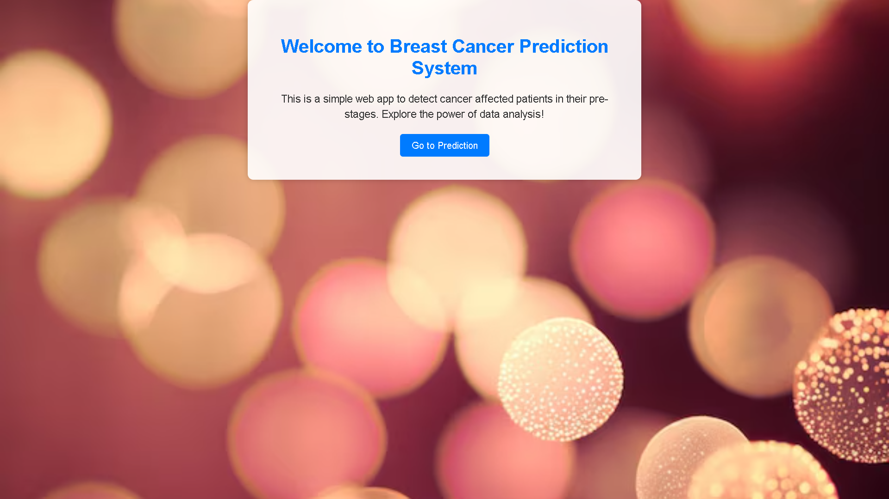

# Breast Cancer Prediction Project 

This repository contains a machine learning project for predicting the occurance of Breast Cancer using the datasets 30 features. This dataset is directly available in the sklearn library.

<br>The Dataset detailed information is available on  : https://archive.ics.uci.edu/dataset/17/breast+cancer+wisconsin+diagnostic

This project is a an example of Binary Classification Problem. We have used multiple Classification algorithms and the best algorithm is used for the prediction.


List of models the project uses to train on the dataset -

- Logistic Regression
- Support Vector Machine
- Gaussian Naive Bayes
- Random Forest Regressor
- Gradient Boosting
- Decision Tree
- Neural Network (MLP)

## Project Structure

The project is organized as follows:

- `requirements.txt`: This file lists all the Python libraries and dependencies required to run the project.
  
- `.gitignore`: This file specifies which files and directories should be ignored by Git.

- `README.md`: This file is an outcome of displaying the projects documentation.

- `application.py`: This is the Flask application file responsible for hosting the web application.

- `notebooks`: This directory contains Jupyter notebooks used for data exploration, visualization and model training . The `data` folder within this directory contains the dataset used for this project.

- `setup.py`: This is the setup file for the project, which may include additional configuration settings.

- `src`: This directory contains the source code for the project, organized into several subdirectories and files:
    - `logs`: This directory contains log files generated by the project.
    - `components`: This directory contains Python modules for various project components, including:
        - `data_ingestion.py`: Handles the process of loading and preparing the dataset.
        - `data_transformation.py`: Performs data preprocessing and feature engineering.
        - `model_trainer.py`: Contains code for training and evaluating machine learning models.
    - `pipelines`: This directory contains data processing or machine learning pipelines used in the project, including:
        - `training_pipeline.py`: Defines the training pipeline for model development.
        - `prediction_pipeline.py`: Defines the pipeline for making predictions using the trained model.
    - `exception.py`: Thos file provide a way to create and raise user-defined errors with specific context and messaging, enhancing error handling and code clarity.
    - `logger.py`: This file helps us to record and manage application events and information, facilitating debugging and monitoring.
    - `utils.py`: Contains utility functions used throughout the project.
 
- `artifacts` : This folder contains the train,test and raw csv files along with the preprocessed and best model pickle file.

- `templates` : This folder contains the HTML files used for obtaining user input via form and flask uses these files as a rendering template.


## Getting Started

To get started with this project, follow these steps:

1. Clone the repository to your local machine using the following command:

```bash
git clone https://github.com/Adi3042/Breast-Cancer-Prediction.git
```

2. Navigate to the project directory:

```
cd Breast-Cancer-Prediction
```

3. Install the required dependencies using pip:

```
pip install -r requirements.txt
```

4. Run the Flask application:

```
python application.py
```

5. Open your web browser and go to

 ``http://127.0.0.1:5000/`` - to access the home page
   
``http://127.0.0.1:5000/predict`` - to perform prediction on the Breast Cancer Prediction web application.

## Usage

Once you have the web application running, you can use it to predict the occurence of breast cancer based on the input features. Simply provide the required information, and the application will provide you with the prediction.

Additionally, you can explore the Jupyter notebooks named `EDA` and `Model Training` in the `notebooks` directory to understand the data analysis and model development process.

## Screenshots





## Contributing

Contributions are welcome! If you'd like to contribute to this project, please follow these steps:

1. Fork the repository.
2. Create a new branch for your feature or bug fix: `git checkout -b feature-name`.
3. Make your changes and commit them: `git commit -m 'Description of your changes'`.
4. Push your changes to your fork: `git push origin feature-name`.
5. Create a pull request on the original repository.
